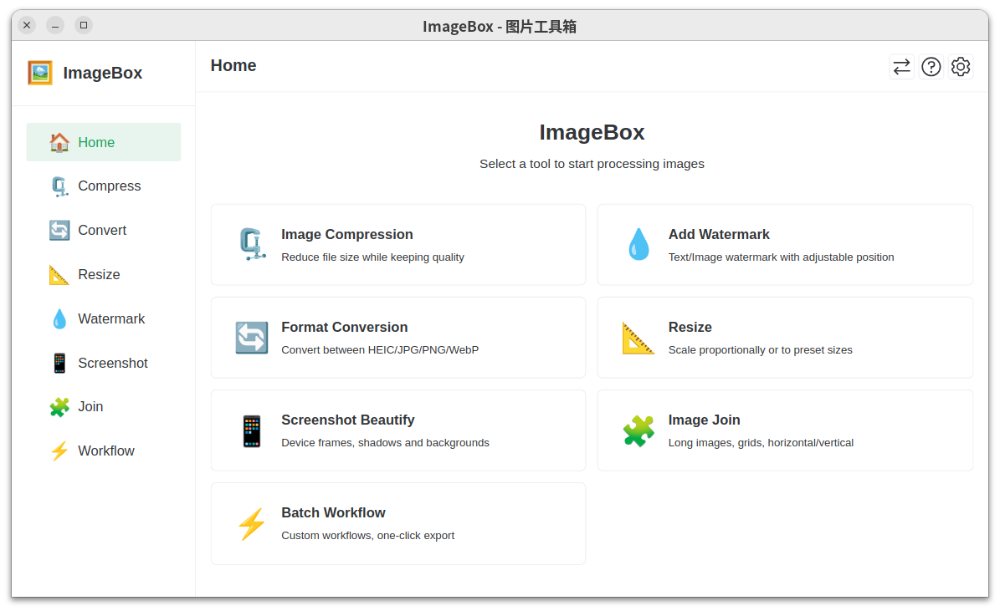

# ImageBox

A powerful image processing toolkit for [Canbox](https://rexlevin.github.io/canbox-pages/) - your all-in-one image toolbox.

[中文文档](./README_zh-CN.md)

## Overview

ImageBox is a Canbox-based application that provides a comprehensive set of image processing tools. Built with Vue 3 and TDesign, it offers a modern, intuitive interface for all your image manipulation needs.

## Features

- 🗜️ **Image Compression** - Reduce file size while maintaining quality
- 💧 **Watermark** - Add text watermarks with customizable position, opacity and font
- 🔄 **Format Conversion** - Convert between JPG, PNG, WebP, GIF, HEIC and more
- 📐 **Resize** - Adjust dimensions with aspect ratio control and presets
- 📱 **Screenshot Beautify** - Add device frames, gradients, and shadows to screenshots
- 🧩 **Image Join** - Combine images horizontally, vertically, or in grid layout
- ⚡ **Batch Workflow** - Create custom processing pipelines for batch operations
- 🌐 **Internationalization** - Support for English and Simplified Chinese

## Tech Stack

- **Framework**: Vue 3 + JavaScript
- **UI Library**: Naive UI
- **State Management**: Pinia
- **Image Processing**: Jimp + heic-decode
- **Build Tool**: Vite
- **Internationalization**: vue-i18n

## Why ImageBox?

- 🚀 **Pure JavaScript** - No native dependencies, works across all platforms
- 🖼️ **HEIC Support** - Full support for iPhone photos
- 🎯 **Canbox Integration** - Seamlessly works with Canbox APIs (file system, clipboard, notifications)
- 📱 **Modern UI** - Dark/Light theme with smooth animations
- ⚡ **Fast & Efficient** - Batch processing with progress tracking
- 🌐 **Multi-language** - Switch between English and Chinese instantly

## Installation

```bash
# Clone the repository
git clone <repository-url>
cd cb-imagebox

# Install dependencies
npm install

# Run in development mode
npm run dev

# Build for production
npm run build
```

## Usage

1. Launch ImageBox from your Canbox application launcher
2. Select a tool from the sidebar (or use top-right settings/help icons)
3. Upload images via drag & drop, file selection, or clipboard paste
4. Adjust settings and preview results in real-time
5. Export processed images to your desired location
6. Change language anytime via the settings panel

## Canbox Platform

ImageBox is built on top of [Canbox](https://rexlevin.github.io/canbox-pages/) - a powerful desktop application framework. Learn more about Canbox and its capabilities at:

🔗 https://rexlevin.github.io/canbox-pages/

## Screenshots



## Roadmap

All core features have been implemented in v0.0.3:

- [x] Basic project setup
- [x] Image compression module
- [x] Watermark module
- [x] Format conversion module
- [x] Resize module
- [x] Screenshot beautify module
- [x] Image join module
- [x] Batch workflow module
- [x] Settings and preferences
- [x] Internationalization (English / Chinese)

## Contributing

Contributions are welcome! Please feel free to submit a Pull Request.

## License

Licensed under [Apache License 2.0](./LICENSE)

## Acknowledgments

- Built for [Canbox](https://rexlevin.github.io/canbox-pages/)
- UI components by [Naive UI](https://www.naiveui.org/)
- Image processing powered by [Jimp](https://github.com/jimp-dev/jimp)
- HEIC support by [heic-decode](https://github.com/catdad-experiments/heic-decode)
