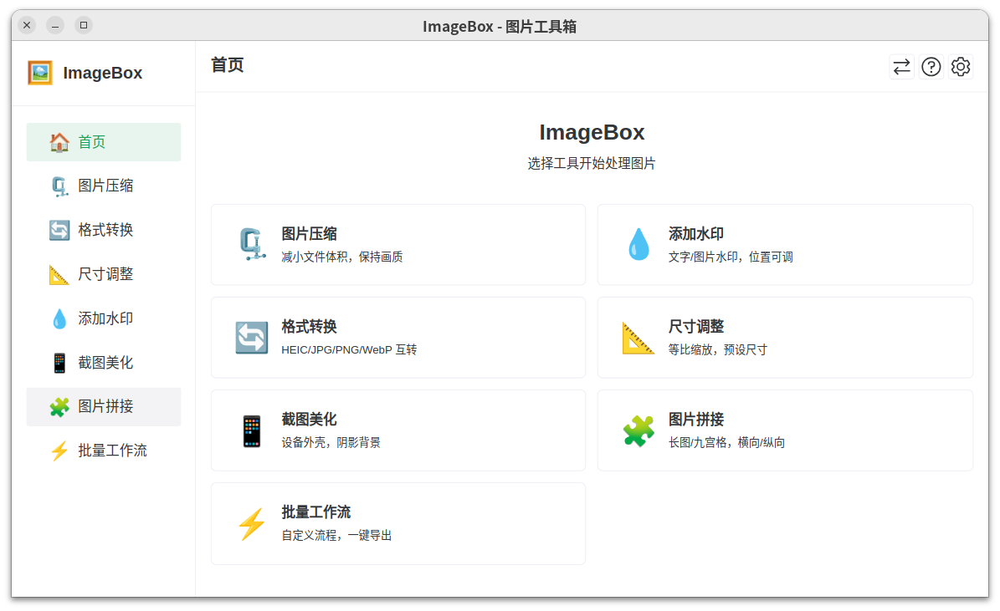

# ImageBox

一个基于 [Canbox](https://rexlevin.github.io/canbox-pages/) 的强大图片处理工具箱 - 你的全能图片工具集合。

[English Documentation](./README.md)

## 简介

ImageBox 是一款基于 Canbox 平台的图片处理应用。采用 Vue 3 和 Naive UI 构建，为所有图片处理需求提供现代化、直观的操作界面。

## 功能特性

- 🗜️ **图片压缩** - 在保持画质的同时减小文件体积
- 💧 **添加水印** - 支持文字水印，可自定义位置、透明度和字体
- 🔄 **格式转换** - 支持 JPG、PNG、WebP、GIF、HEIC 等格式互转
- 📐 **尺寸调整** - 调整图片尺寸，支持比例锁定和预设尺寸
- 📱 **截图美化** - 为截图添加设备外壳、渐变背景和阴影效果
- 🧩 **图片拼接** - 支持横向、纵向和网格布局拼接
- ⚡ **批量工作流** - 创建自定义处理流程，批量处理图片
- 🌐 **国际化** - 支持简体中文和 English

## 技术栈

- **框架**: Vue 3 + JavaScript
- **UI 组件库**: Naive UI
- **状态管理**: Pinia
- **图片处理**: Jimp + heic-decode
- **构建工具**: Vite
- **国际化**: vue-i18n

## 为什么选择 ImageBox?

- 🚀 **纯 JavaScript** - 无原生依赖，跨平台运行
- 🖼️ **HEIC 支持** - 完整支持 iPhone 照片格式
- 🎯 **Canbox 集成** - 无缝对接 Canbox API（文件系统、剪贴板、通知等）
- 📱 **现代界面** - 深色/浅色主题，流畅动画
- ⚡ **快速高效** - 批量处理，实时进度追踪
- 🌐 **多语言** - 中英文即时切换

## 安装

```bash
# 克隆仓库
git clone <repository-url>
cd cb-imagebox

# 安装依赖
npm install

# 开发模式运行
npm run dev

# 生产构建
npm run build
```

## 使用方法

1. 从 Canbox 应用启动器启动 ImageBox
2. 从侧边栏选择需要的工具（也可使用右上角设置/帮助图标）
3. 通过拖拽、文件选择或剪贴板粘贴上传图片
4. 调整设置并实时预览效果
5. 导出处理后的图片到指定位置
6. 随时通过设置面板切换语言

## Canbox 平台

ImageBox 构建于 [Canbox](https://rexlevin.github.io/canbox-pages/) 之上 - 一个强大的桌面应用框架。了解更多关于 Canbox 的信息：

🔗 https://rexlevin.github.io/canbox-pages/

## 界面预览



## 开发计划

v0.0.3 版本已完成所有核心功能：

- [x] 项目基础架构搭建
- [x] 图片压缩模块
- [x] 水印模块
- [x] 格式转换模块
- [x] 尺寸调整模块
- [x] 截图美化模块
- [x] 图片拼接模块
- [x] 批量工作流模块
- [x] 设置和偏好
- [x] 国际化（中英文）

## 参与贡献

欢迎提交 Pull Request 参与贡献！

## 开源协议

基于 [Apache License 2.0](./LICENSE)

## 致谢

- 为 [Canbox](https://rexlevin.github.io/canbox-pages/) 平台构建
- UI 组件由 [Naive UI](https://www.naiveui.org/) 提供
- 图片处理由 [Jimp](https://github.com/jimp-dev/jimp) 驱动
- HEIC 支持由 [heic-decode](https://github.com/catdad-experiments/heic-decode) 提供
